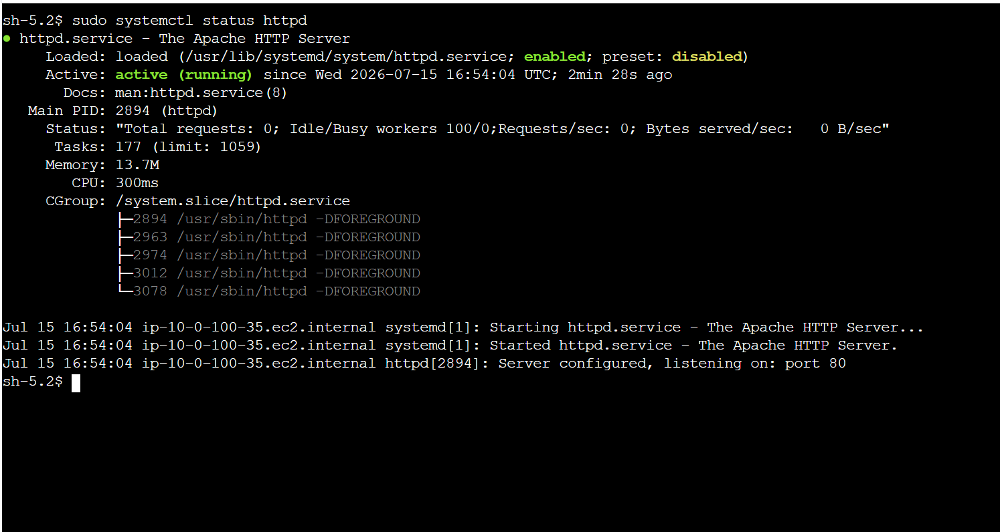
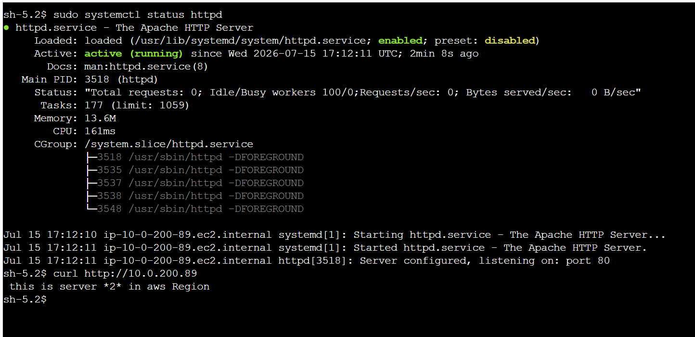
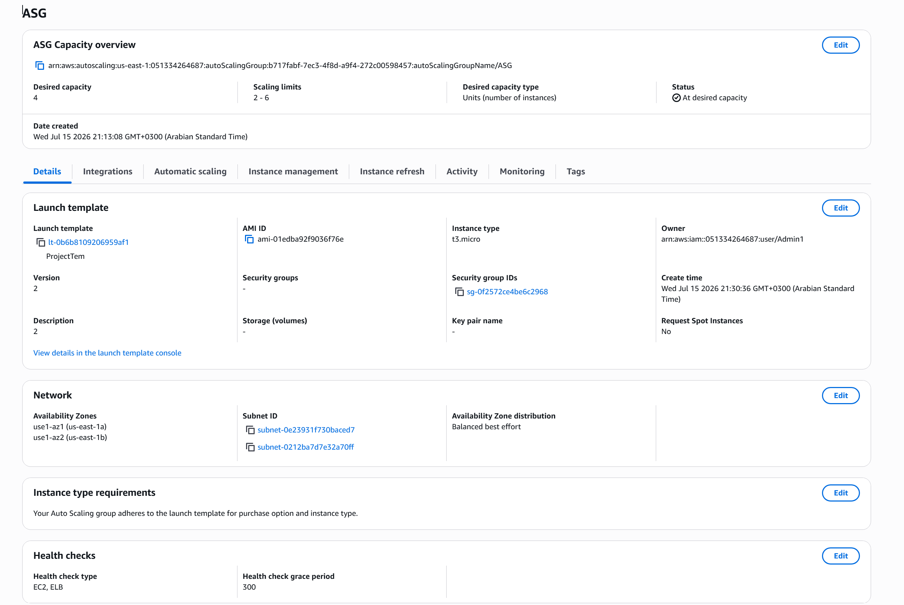
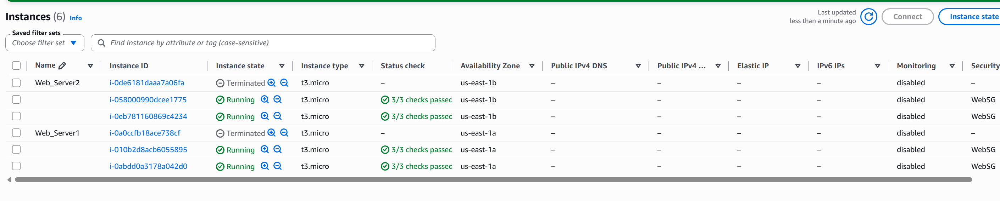
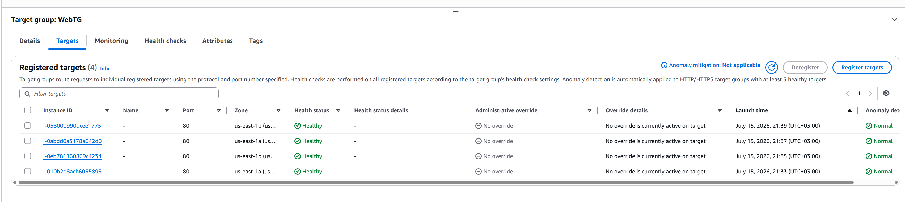
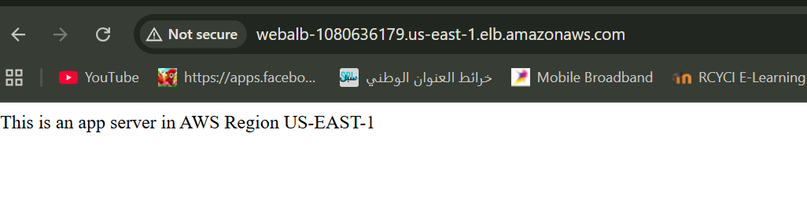

# AWS Multi-Tier Web Application — Custom VPC Capstone

  

A hands-on capstone project: designing and deploying a **highly available, multi-tier web application** inside a custom AWS VPC — built from scratch through the AWS Console.

Two Availability Zones, private web servers behind an internet-facing Application Load Balancer, per-AZ NAT Gateways, and an Auto Scaling Group that launches and replaces instances automatically.

---

## Architecture

**Traffic flow**

- **Inbound:** Internet → IGW → ALB (public subnets) → Target Group → EC2 web servers (private subnets)
- **Outbound:** EC2 (private) → NAT Gateway in the *same AZ* → IGW → Internet (OS updates and packages only)

Web servers have **no public IPs** — they are reachable only through the load balancer.

---

## Resources Built

| Layer | Resource | Details |
|-------|----------|---------|
| Network | VPC | `10.0.0.0/16` — DNS hostnames enabled |
| Network | Subnets ×4 | Public `10.0.10.0/24`, `10.0.20.0/24` · Private `10.0.100.0/24`, `10.0.200.0/24` — across `us-east-1a` / `us-east-1b` |
| Network | Internet Gateway | Attached to the VPC — default route for public subnets |
| Network | NAT Gateways ×2 | One per AZ, each with an Elastic IP — outbound internet for private subnets |
| Routing | Route tables ×3 | `Public_RT → IGW` · `Private_RT_1 → NAT GW A` · `Private_RT_2 → NAT GW B` |
| Security | Security Groups ×2 | `WebSG` (web tier) · `ALBSG` (load balancer) |
| Access | IAM Role `ec2tossm` | SSM Session Manager access — no SSH keys, no bastion host |
| Compute | EC2 instances | Amazon Linux 2023, EBS-backed, Apache installed via user data |
| High availability | ALB + Target Group | Internet-facing `WebALB` → `WebTG`, HTTP :80 health checks |
| High availability | Auto Scaling Group | Launch template — min 2 / desired 4 / max 6 — EC2 + ELB health checks |

---

## Design Decisions

**Why a NAT Gateway per AZ (and separate private route tables)?**

Each private subnet sends `0.0.0.0/0` to the NAT Gateway in its **own** AZ:

- **Fault isolation** — if one AZ fails, the other AZ keeps full outbound internet access
- **No cross-AZ data transfer charges** — traffic stays inside its AZ
- The two public subnets share one route table since both simply target the single IGW

**Why identical instances behind the ASG?**

Auto Scaling treats every instance as interchangeable — the launch template bootstraps each one with the same user data script, so any instance can be replaced at any time with zero manual work.

---

## Build Phases

1. **VPC and subnets** — custom VPC, 4 subnets across 2 AZs, IGW, public route table, auto-assign public IP enabled on public subnets
2. **NAT Gateways** — one per public subnet with Elastic IPs, plus the two private route tables
3. **IAM + EC2** — `ec2tossm` role for SSM, two EBS-backed instances launched into the private subnets with Apache bootstrapped via user data
4. **High availability** — target group `WebTG`, security group `ALBSG`, internet-facing `WebALB` spanning both public subnets
5. **Auto Scaling** — launch template + ASG (2 / 4 / 6) attached to `WebTG` with ALB health checks, then a clean cutover: the original manual instances were terminated once the ASG fleet turned healthy
6. **Security hardening** — `WebSG` inbound locked down to accept traffic only from `ALBSG`

---

## Verification

**Apache verified over SSM Session Manager (private instances — no SSH, no bastion)**

**ASG at desired capacity across both AZs**

**Manual → Auto Scaling cutover (original servers terminated, ASG fleet running)**

**All targets healthy in the target group**

**End-to-end test through the ALB DNS name**

---

## Troubleshooting Log — the real learning

**1. ALB health checks timing out (`Request timed out`)**

- **Cause:** `WebSG` inbound source was `0.0.0.0/16` — a typo for `10.0.0.0/16`. That CIDR covers a meaningless `0.x.x.x` range, so health-check traffic was silently dropped.
- **Fix:** corrected the source CIDR — targets turned healthy within a minute.

**2. ASG instances launching without Apache (`Unit httpd.service could not be found`)**

- **Cause:** the user data script copied from a PDF was silently corrupted — `httpd` became `hFpd` and the shebang read `#!bin/bash` (missing `/`), so the script never ran.
- **Diagnosis:** SSM into a fresh instance → `systemctl status httpd` → inspected `/var/log/cloud-init-output.log`.
- **Fix:** created launch template **v2** with the corrected script and let the ASG replace the broken instances automatically.

**Lesson:** always paste user data into a plain-text editor first, and verify boot behavior with `cloud-init-output.log`.

---

## Cleanup

To avoid ongoing charges, everything is torn down at the end: Auto Scaling Group → ALB → Target Group → NAT Gateways (+ release Elastic IPs) → EC2 instances → VPC.

---

## Skills Demonstrated

VPC design and CIDR planning · Multi-AZ high availability · Route tables and NAT architecture · Security group layering · IAM roles and SSM Session Manager · ALB and target groups · Launch templates and Auto Scaling · Real-world debugging (health checks, cloud-init, security groups)

---

*Built as the capstone project for an AWS Core Services course (DolfinED) — July 2026.*
